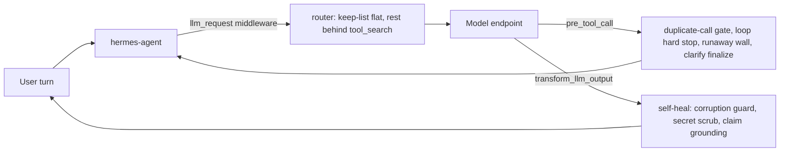

# saandal

**A reliability plugin for [hermes-agent](https://github.com/NousResearch/hermes-agent), for people who run it on a self-hosted or small model. It stops the tool-call loops, empty or corrupted answers and leaked secrets that a strong-model harness ships, and it does so on 69% fewer tokens.**

[](LICENSE)
[](https://github.com/Podwarden/saandal/actions/workflows/ci.yml)
[](https://www.python.org/)

Same 15 prompts, same model (`deepseek-v4-pro`), isolated homes, tokens read from hermes's own `state.db`. Measured 2026-07-24 with [`tests/token_bench.py`](tests/token_bench.py):

| | hermes alone | with saandal | change |
|---|---:|---:|---:|
| Tokens, 15 prompts | 900,511 | 279,837 | **-69%** |
| Wall time | 751 s | 347 s | **-54%** |
| API calls | 52 | 43 | -17% |
| Estimated cost (listed $/M rates) | $0.0461 | $0.0187 | -59% |

On the 44-prompt judged corpus, same model, same judge ([`tests/run_corpus.py`](tests/run_corpus.py), 2026-07-24), saandal passed 44/44 against 43/44 for hermes alone. The one it won is a secret leak hermes shipped. Details, including the regression we found on the way, are in [Does it hurt a strong model](#does-it-hurt-a-strong-model).

**Install** (out-of-tree; nothing in site-packages is edited):

```bash
git clone https://github.com/Podwarden/saandal.git
cd saandal
python bin/install.py     # copies plugin/ into ~/.hermes/plugins/router/ and each profile; seeds config keys only when absent
python bin/verify.py      # exit 0 = active everywhere
```

Then enable it in `~/.hermes/config.yaml` (and each `profiles/*/config.yaml`) and restart your hermes gateway:

```yaml
plugins:
  enabled: [router]
```

The project is saandal; the installed module is `router`. The module name predates the project.

## Another wrapper between you and your model

That is the right default about middleware, and if saandal did what wrappers usually do you should walk away. So, up front:

- It does not slow a strong model down. Measured, turns get cheaper and faster (the table above).
- It does not break on `hermes update`. It is out-of-tree, and if an internal hermes API it adapts moves, it falls back to plain hermes with a warning in the gateway log.
- It does not trade correctness for a demo win. Head-to-head on the same prompts it scores 44/44 against hermes's 43/44, and we show the build that scored 79.5% below.

Every claim on this page has a harness in this repo next to it.

## The failures you have probably watched

You point hermes-agent, built and tuned for frontier hosted models, at your own 27B on vLLM, and things break that a hosted model never showed you. A one-line question turns into a silent loop that burns the 90-call budget and times out with nothing. The model invents a figure and ships it looking sourced. A long answer collapses into word salad at the tail and is delivered anyway. A secret from a config file is echoed straight into the reply. One failing tool call is repeated 40 times until the budget dies.

None of that is the model's ceiling. It is a strong-model harness meeting a smaller model under load, with no reason to defend against it. saandal does not make the model smarter; it stops the model losing points it had already earned.

## The failures it stops

Each row is a failure reproduced on a live session, with a fix, a config key and tests. The linked changelog entry has the evidence and the residuals.

| Failure | hermes alone | with saandal |
|---|---|---|
| Same tool call repeated 40+ times, succeeding each time, until the 90-call budget dies | loops to the budget | duplicate-call gate, then a loop hard stop ([v1.5.3](CHANGELOG.md#general-duplicate-call-gate-v153)) |
| Deferred tool called by its bare name; three strikes kill the turn | turn dies | bare-name calls execute through the normal path ([v1.5.0](CHANGELOG.md#graceful-flat-name-fallback-v150)) |
| Runaway repetition streams for 10 minutes under a 65,536-token cap | no effective output cap | `max_tokens` clamp, recoverable continuation ([v1.5.1](CHANGELOG.md#model-side-decoding-mitigations-v151)) |
| Long answer collapses into word salad at the tail | shipped as-is | anti-tail-collapse sampling ([v1.8.2](CHANGELOG.md#anti-tail-collapse-sampling-params-v182)) |
| Token corruption or emoji spew as the answer | delivered verbatim | corruption guard withholds it and fails honestly ([v1.7.3](CHANGELOG.md#token-corruption--mutating-fragment-guard-v173), [v1.8.3](CHANGELOG.md#final-polish--emoji-spew-guard--interim-delivery-gap-v183)) |
| Streaming turn hangs for 12 minutes | no per-turn wall clock | stale timeout plus a tier-independent runaway wall ([v1.8.4](CHANGELOG.md#hard-bounding-a-hung-streaming-turn-v184--12-min-turn-incident), [v1.20.1](CHANGELOG.md#clarify-finalize--tier-independent-runaway-wall-v1201)) |
| Session history poisoned by earlier failures, which the model then repeats | learns the failure | proactive poison reset ([v1.7.1](CHANGELOG.md#proactive-poison-reset--phraseintent-degeneracy-v171)) |
| Empty or `(empty)` final response | ships the empty string | forced synthesis with an honest diagnostic ([v1.6.0](CHANGELOG.md#session-self-healing-v160)) |
| A secret echoed into a reply | delivered | outgoing secret scrub ([v1.6.1](CHANGELOG.md#corpus-batch-1-fixes-v161)) |
| Invented figures presented as sourced | shipped as fact | claim grounding appends an "Unverified figures" caveat; it never rewrites the answer ([v1.17.0](CHANGELOG.md#anti-fabrication--claim-grounding-v1170)) |
| "Fix it." with no context: the model digs through history and over-executes | guesses or loops | clarify guard asks one question, then ends the turn ([v1.18.0](CHANGELOG.md#clarify-vs-execute-guard-v1180), [v1.20.1](CHANGELOG.md#clarify-finalize--tier-independent-runaway-wall-v1201)) |
| No progress signal on a long turn | silence for minutes | intermediate progress messages ([v1.7.0](CHANGELOG.md#intermediate-progress-messages-v170)) |

Every guard is fail-safe: an internal error passes the turn through untouched. Every guard turns off with one config key (see [Rollback](#rollback)).

The token saving comes from the router. hermes sends its full flat tool schema on every call; saandal keeps a short list of tools flat (about 10 KB, [`docs/router_design.md`](docs/router_design.md)) and reaches every other tool through hermes's own `tool_search` / `tool_describe` / `tool_call` bridge. Per category the saving was: trivial -72%, single tool -57%, research -74%, coding -44%, long output -48%. The bridge did not flip the net cost even on tool-heavy turns.

## Does it hurt a strong model

The fair fear about any reliability layer is that it earns its keep on a weak model and then quietly costs you on a strong one. We measured exactly that, head-to-head on the same 44-prompt corpus with the same judge, on `deepseek-v4-pro` ([`tests/run_corpus.py`](tests/run_corpus.py), 2026-07-24):

| Build | Pass rate | |
|---|---:|---|
| hermes alone | 97.7% (43/44) | reference |
| saandal, guards ungated (v1.14) | 79.5% | the guards did mis-fire on a strong model |
| host-gated guards (v1.15) | 95.3% | |
| tiers, anti-fabrication, clarify guard (v1.18) | 97.7% (43/44) | tie |
| clarify finalize (v1.20.1) | 100% (44/44) | one more than hermes alone |

The 79.5% is why saandal has a model-tier system: any guard that could ever alter an answer calibrates to the tier, full strength on a weak self-hosted model, inert or evidence-gated on a frontier model that does not need it. The two tier-independent pieces, the token shrink and the secret and claim-grounding scrubs, apply everywhere, which is how saandal ends one prompt ahead: it catches a secret leak hermes ships, and it turns a 560 s clarify loop into a 19 s clarifying question.

One caveat on the judging: a searched, honestly hedged answer counts as a pass under the rubric both arms were scored on. A stricter fabrication standard would move both numbers, not the gap.

## When you do not need this

- You run only a frontier hosted model and do not care about the token bill. You still get the token saving and the secret and claim-grounding scrubs, but the reliability guards mostly will not fire.
- You do not run hermes-agent. saandal is a hermes plugin and has nothing to attach to.
- You are fine shipping the occasional silent-garbage answer. Then you do not have the problem this solves.

If you run a self-hosted or small-context model through hermes and you have seen the failures above, that is the fit.

What saandal is not: it does not turn a 27B into a frontier model. It removes the avoidable failures, so what is left is bounded by what your model can do, and when the model cannot do something it says so instead of shipping garbage.

---

The sections above are the pitch. What follows is reference.

## Requirements

- Python 3.11.
- A working [hermes-agent](https://github.com/NousResearch/hermes-agent) install; the plugin imports it at runtime. Built against hermes-agent 0.18.2.
- An OpenAI-compatible model endpoint, for example vLLM.
- `ddgs` for the DuckDuckGo search backend (`pip install ddgs`).

## Rollback

Every accommodation is one key in `config.yaml`, no reinstall:

| Set this | To restore |
|---|---|
| `tools.tool_search.enabled: "off"` | hermes's flat tool schemas |
| `tools.tool_search.constrained_decoding: "off"` | unconstrained tool-call decoding |
| `tools.tool_search.flat_name_fallback: "off"` | hermes's bare-name rejection |
| `tools.tool_search.selfheal.enabled: "off"` | no self-healing guards |
| `tools.tool_search.antifab: "off"` | no claim-grounding caveat |
| `tools.tool_search.clarify_guard: "off"` | no clarify nudge |
| `tools.tool_search.clarify_finalize: "off"` | clarify no longer ends the turn |
| `tools.tool_search.runaway_wall: "off"` | no runaway backstop |

[CHANGELOG.md](CHANGELOG.md) lists every other knob with its rationale and tests.

## Upgrading

The plugin and its config live under `~/.hermes`, which `pip` and `hermes update` never touch, so nothing needs reapplying. The one real risk is upstream renaming the `tools/tool_search` internals the plugin adapts. The plugin detects that itself and falls back to flat tools (full capability, no token saving) with a warning in the gateway log.

```bash
hermes update
python bin/verify.py      # exit 0 = router active everywhere
# restart gateways: hermes gateway restart; per profile: hermes --profile <p> gateway restart
```

If `verify.py` reports API drift, bots keep working on flat schemas. Adapt `plugin/__init__.py` to the new upstream symbols, run `bin/install.py`, restart the gateways and re-run `bin/verify.py`.

## How it works

One out-of-tree plugin registered through hermes's plugin API:



1. **The router** narrows hermes's Tool Search never-defer set to a configurable keep-list, so the flat tool payload collapses behind the in-tree `tool_search` / `tool_describe` / `tool_call` bridge.
2. **The reliability layer** is an `llm_request` middleware plus lifecycle hooks (`pre_tool_call`, `transform_tool_result`, `transform_llm_output`, `post_api_request`, `pre_gateway_dispatch`) that implement the guards in the table above. Every hook is fail-safe.
3. **A guarded monkeypatch harness** (`plugin/monkeypatch.py`) for the rare core override a hook cannot reach. It is inert by default, symbol-guarded and self-skipping.

Design rationale: [`docs/router_design.md`](docs/router_design.md) and [`docs/selfheal_design.md`](docs/selfheal_design.md). Full per-version history, with the failure evidence, fix, config key, tests and residuals for every guard, is in [CHANGELOG.md](CHANGELOG.md).

### Repository layout

- `plugin/`: source of truth for `~/.hermes/plugins/router/` and each `~/.hermes/profiles/*/plugins/router/` (copies, not symlinks). Modules: `__init__.py` (router, constrained decoding, coding classifier), `selfheal.py` (state machine, guards, special-token strip), `antifab.py`, `topics.py`, `progress.py`, `loadaware.py`, `web_local.py`, `monkeypatch.py`.
- `bin/install.py`: idempotent rollout. `bin/verify.py`: health check.
- `tests/`: offline unit suites (`python tests/test_*.py`), the token benchmark and the judged-corpus runner.
- `docs/`: design and verification documents.

Development: edit under `plugin/` in this repo, run `python bin/install.py` (fans out to root and profiles) and restart the gateways. Never edit `~/.hermes/plugins/router/` directly; the next install overwrites it. See [CONTRIBUTING.md](CONTRIBUTING.md) for the fail-safe covenant, DCO sign-off and tests.

### Known upstream issues (hermes-agent 0.18.2)

- **No turn-end continue hook for non-coding turns.** `pre_verify` is gated on file mutations, so a "produced zero tool calls, announced intent" retry nudge cannot be built as a plugin. Ask: fire `pre_verify` (or a new `pre_turn_end`) regardless of `_turn_file_mutation_paths`.
- **Turn-finalizer summary bypassed on an empty final response.** A turn ending with `final_response == ""` skips finalization, so the user gets silence. The loop hard stop reduces how often this is reached.
- **Interim assistant messages bypass `transform_llm_output`.** Model narration emitted alongside a tool call has no plugin hook, so a rare corrupted narration can ship. Ask: a `transform_interim_output` hook.
- **Length continuation should use `continue_final_message`.** hermes's native `finish_reason == "length"` continuation uses a user "continue" nudge that makes the model restart or drift. `continue_final_message` is clean in isolation but leaked `<|im_end|>` through hermes's streaming transport (see the v1.10.0 changelog entry). Ask: make the internal continuation use it and strip special tokens from the stream.

## License

saandal is licensed under the GNU Affero General Public License v3.0 or later (`AGPL-3.0-or-later`); see [LICENSE](LICENSE). AGPL includes the network-use clause (section 13): if you run a modified saandal as part of a network service, you must offer that service's users the corresponding source.

Copyright (C) 2026 Podwarden Inc. Contributions are accepted under the DCO (see [CONTRIBUTING.md](CONTRIBUTING.md)).

### Not affiliated with Nous Research

"Hermes" and "hermes-agent" are the property of Nous Research. saandal is an independent community project, not produced, endorsed, sponsored by or affiliated with Nous Research. hermes-agent is distributed separately under the MIT license; saandal plugs into it and neither includes nor modifies its source.
